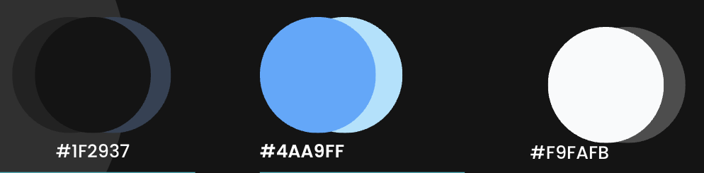
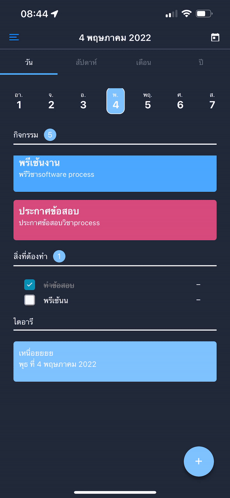
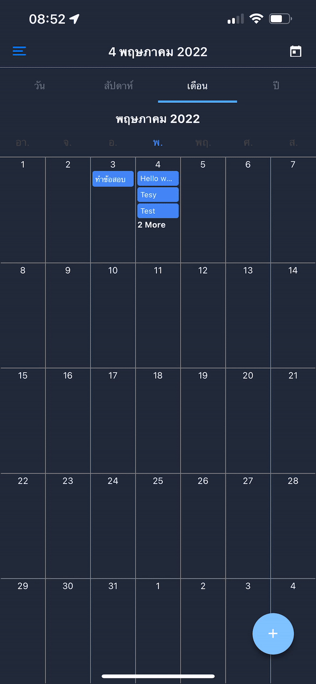
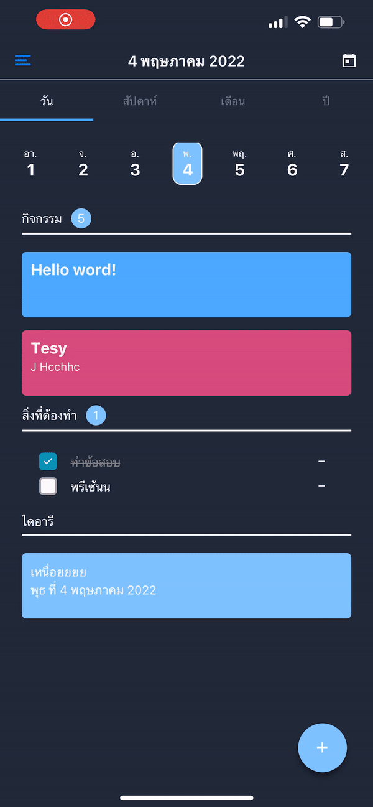
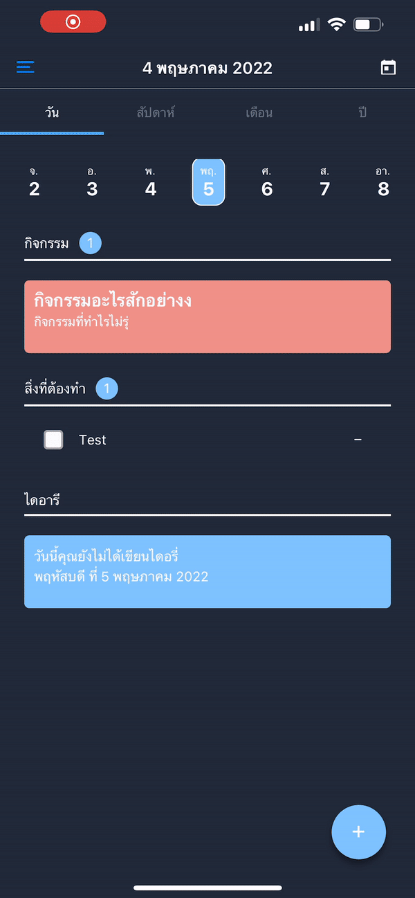

# Karénda

> Karénda is a Calendar and Planner Application implement in React Native

>> this repository is no longer maintained 

## Pain Point
- No have Planner or Calendar Application to support variety of Use case.
- General Planner or calendar app seem to not beginner friendly(Bad Ux)
- Calendar App no have fancy feature to support variety of use case

## Design decision

### Color Usage

-  Color :  #1F2937  
	- Make app more comfortable to watch 
- Color :   #4AA9FF 
	-  Main theme of `Karénda` 
- Color :  #F9FAFB 
	- Primary Text Color

## Features

- Support TH/EN Languauge
- Calendar View
	- Day
	- Week
	- Month
	- Year
- Quick Action with FAB (Float Action Button)
- Quick Setting with Drawer panel
- Quick Event
	- Summary next 7 day event with Full screen modal
- Todo list 
- Event System
	- Create Event
	- Delete Event 
	- Notification Event
- Dairy
	-  Create Dairy
	- attach Image

## Not Implemented
	[x] Mood system
	[x] Year Mood Summary
	[x] Todo list summary weekly/yearly

## Stacks

- React Native For Mobile Cross platform development
- Redux for state managements
- React Navigation for navigation
- i18n for localization

## File Description

| Path | Description |  
| ----------- | ----------- |  
| [./stackScreen](./stackScreen) | provide all StackScreen |  
| [./drawerScreen](./drawerScreen) | provide all DrawerScreen |
| [./app.js](./app.js) | Root of the Application provide all context wrapper|
| [./index.js](./index.js) | EntryPoint (Register Component)|
| [./translations](/translations) | Localization Logic and Translation script|

## Demo

Calendar             |  Quick add | Quick Event
:-------------------------:|:-------------------------:|:-------------------------:
  |   | 

Dairy            | Todo List
:-------------------------:|:-------------------------:
 | 

## Authors

- [Maszz](https://github.com/Maszz)
